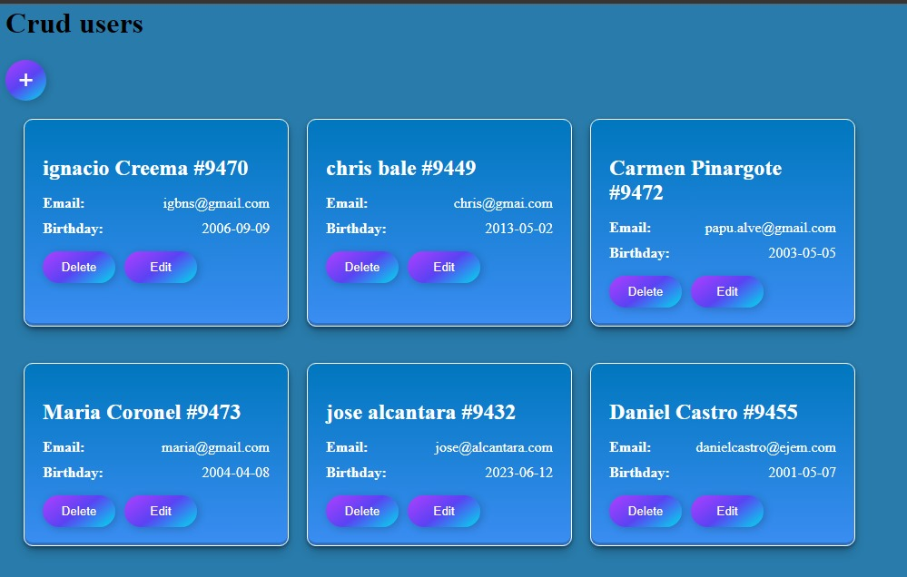
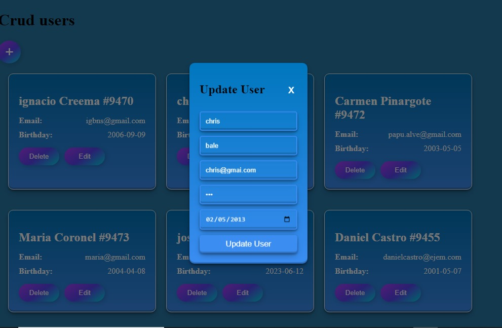
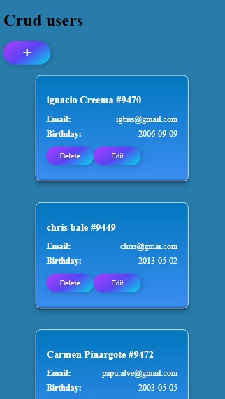
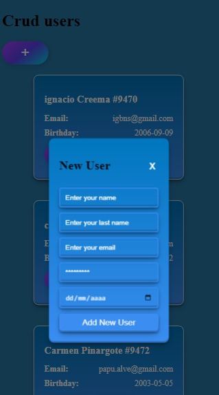

# CRUD de Usuarios con React

Este proyecto es una aplicación web que permite la creación, lectura, actualización y eliminación (CRUD) de usuarios. Está construido con React y utiliza hooks personalizados para las operaciones CRUD.

## Características

- Lista todos los usuarios.
- Permite añadir nuevos usuarios.
- Permite editar la información de los usuarios existentes.
- Permite eliminar usuarios.

## Capturas

## Tecnologías Utilizadas

- React
- Hooks personalizados
- CSS para estilos

## Instalación

Para ejecutar este proyecto localmente, sigue estos pasos:

1. Clona este repositorio.
2. Navega hasta la carpeta del proyecto.
3. Ejecuta `npm install` para instalar las dependencias necesarias.
4. Ejecuta `npm start` para iniciar el servidor de desarrollo.

## Uso

Una vez que el servidor de desarrollo esté en funcionamiento, podrás:

- Ver la lista de usuarios en la página principal.
- Utilizar el botón "Create" para añadir nuevos usuarios.
- Editar o eliminar usuarios utilizando las opciones disponibles en cada tarjeta de usuario.

## Contribución

Las contribuciones son bienvenidas. Si tienes alguna sugerencia o corrección, no dudes en abrir un issue o enviar un pull request.

## Licencia

Este proyecto está licenciado bajo la Licencia MIT - vea el archivo [LICENSE.md](LICENSE.md) para más detalles.
